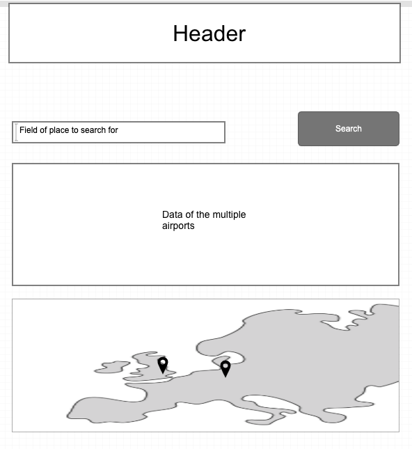
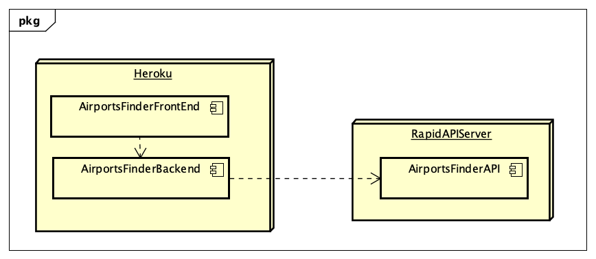
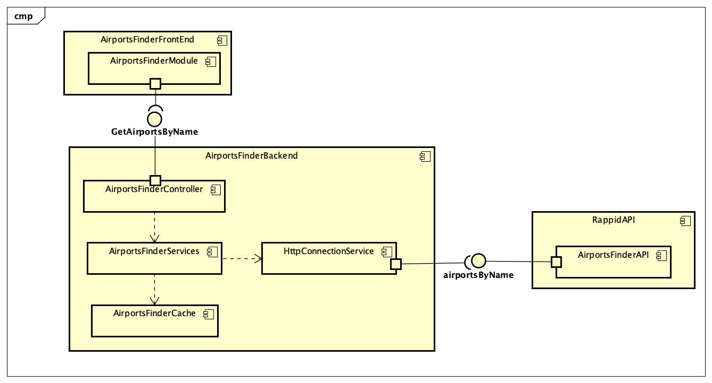

# Parcial 2 andres-vasquez-ARSW-T2

Parcial de segundo tercio

La aplicacion fue diseñada, haciendo uso de spring,java y jquery, y para el despliege se uso de heroku, se uso una api rest usando spring, se uso controladores,servicios y una clase para el springboot.

## Descripción del Problema a Solucionar

Su compañía lo ha seleccionado para construir una aplicación que tiene como objetivo consultar los aeropuertos dado el nombre de un lugar como una ciudad por ejemplo.

La aplicación recibirá en un campo el nombre del lugar por el cual el usuario desea buscar aeropuertos, por ejemplo `London` o `Berlin` y deberá mostrar para cada aeropuerto encontrado:

 - Código del aeropuerto
 - Nombre del aeropuerto
 - Nombre de la ciudad donde se encuentra el aeropuerto
 - Código del País donde se encuentra el aeropuerto

Para obtener dicha información utilice el API gratuito de [AirportsFinder](https://rapidapi.com/cometari/api/airportsfinder?endpoint=57ac4d9be4b02b08ce774cc3) el cual usted debió estudiar previamente antes de este examen.

Se le pide que su implementación sea eficiente en cuanto a recursos así que debe implementar un caché que permita evitar hacer consultas repetidas al API externo.

Una vez tenga la funcionalidad básica, extienda su implementación para incluir un mapa en el cual resalte con un indicador la ubicación (latitud y longitud) de todos los aeropuertos encontrados (revise la funcionalidad del API de mapas y el ejemplo anexo.).

Sugerencia realice la implementación de manera incremental. Haga commits regulares.

Ejemplo de la interfaz.



### Diagrama de Despliegue



### Diagrama de Componentes



## URL HEROKU

https://andres-vasquez-arsw-t2.herokuapp.com/

## EMPEZAR

Copie el proyecto via git clone en cualquier diretorio para empezar a trabajar:
```
https://github.com/vashigo/ANDRES-VASQUEZ-ARSW-T2.git
```

### Prerequisitos

Tener instalado Java jdk versiones 7+, Maven comandos y git

### Instalando

1. Ejecutar en terminal:

```
$$ mvn package
```
2.(opcional):
si requiere la documnetacion del codigo

```
mvn javadoc:javadoc
```
### Ejecutando

2. (Demostracion):
  compile el proyecto en terminal desde la carpeta raiz ejecutando la siguiente linea:
  
```
java -jar target/AirportsFinder_API-1.0-SNAPSHOT.jar
  
```

3. (server):
una vez compilado el programa se ejecuta en el puerto 4567,para probarlo vaya a esta direccion desde su navegador:
```
http://localhost:8080
  
```

## Autor

* **ANDRES DAVID VASQUEZ IBAÑEZ** - *Initial work* - [VASHIGO](https://github.com/vashigo)


## Licencia

This project is licensed under the GNU General Public License - see the [LICENSE](LICENSE) file for details


